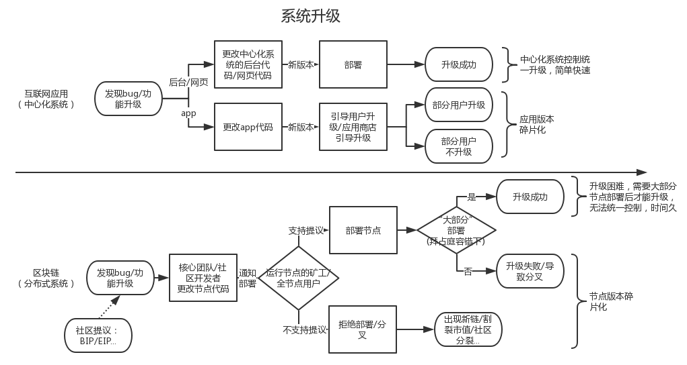
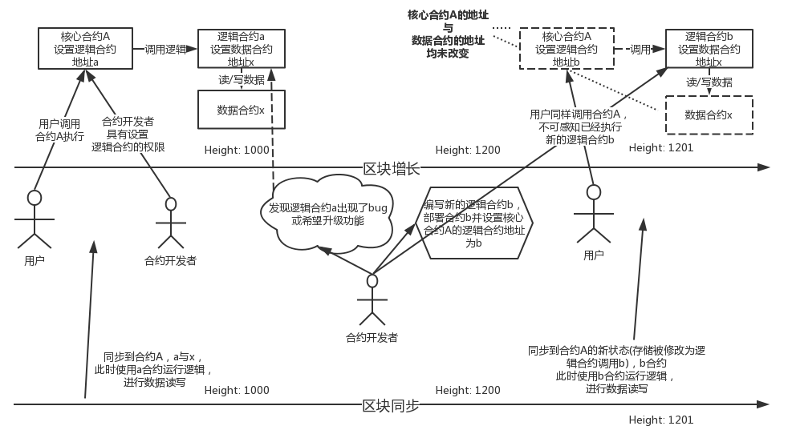
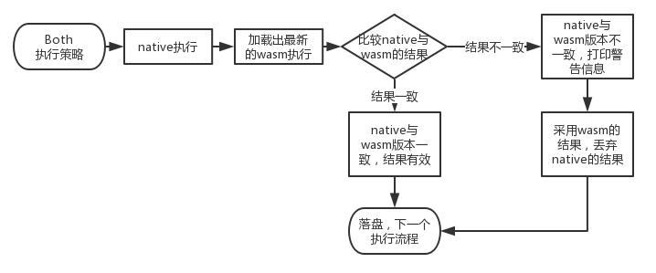

# Substrate 设计总览

截至目前（2019年2月初），Substrate的框架基本稳定。本文将从：

* Substrate的总体设计
* Substrate的项目结构
* 入门参考

三部分对Substrate这个项目进行分析，今后对其各个模块继续进行详细剖析。

本文首先先介绍第一部分：

## Substrate的总体设计

### 一、区块链基础部分与功能部分

直至2019年，一个区块链系统的框架已经基本稳定了。事实上，目前所有的区块链系统几乎都是从比特币/以太坊模型演变而来。一般来说，一个区块链系统应该具有：

* 区块链系统基础部分
  * 共识系统 （区块链分布式基石）
  * p2p连接与广播系统 
  * 存储系统
  * 交易池系统
  * rpc系统（区块链与外界交互主要通道）
* 链的功能

其中系统基础部分是当前区块链模型下都会具备的组件，其中共识与P2P体现区块链的分布式本质。不过对于最后一部分，就是区块链间相互竞争的关键部分。例如：

* 比特币的UTXO结构加上交易脚本
* 以太坊的虚拟机与智能合约
* eos的账户系统及虚拟机
* 有的山寨币特化部分智能合约或部分native层成为系统级功能：
  * 提供随机数
  * 提供质押对赌
  * oracle数据输入
  * 引入复杂密码学方案
  * 等等。。。

与系统基础部分相比，这部分差异很大，提供的是**除去区块链模型外，这条链能够提供的功能**。另一方面在区块链升级中，一般来说系统基础部分改动较小，而链的功能部分改动较大，特别是许多链为了追求开发速度，一开始只能提供转账功能，在后续的版本中才慢慢升级其他功能。

**Substrate作为一个区块链框架，认为所有的链都应该具备区块链系统基础部分，而由开发者自由定制链的功能部分**

Gavin Wood 作为以太坊实际核心的开发者，自然早已对这套系统的框架了然于心，所以从Substrate框架提出的开始（2018年9月），就对区块链系统作出了2个关键的区分：

* Substrate Core
* Runtime

其中Core的部分就是前面提到的系统基础部分，而Runtime部分就是链的功能，也就是说在Substrate架构中分为：

根据这样的划分，当开发者使用Substrate框架的时候，无需关心区块链基础功能也就是Core部分的工作，而只需关心自己链能够提供的功能，也就是Runtime部分的工作。

注意图中虚拟机EVM也是Runtime的一个组件。与以太坊的结构相比，相当于把以太坊的智能合约功能也能随意作为一个链的功能组件添加进入使用Substrate开发的链中。

************

这里一直强调Runtime是“链的功能”有一些通俗与不严谨，这里使用一个更抽象的描述：

**需要对运行结果进行共识的功能部分应该归属于Runtime**

这个定义比较抽象，且由于需要对“世界状态”或类似概念有比较深入的了解才好解释，故不展开讲解。更严格来说，“需要对运行结果进行共识的功能组件”是“链的功能”的一个子集。

这里有一个简单的判定标准判断某个功能是否应该放在Runtime内：

对于某个功能，若只改动一个节点的代码对于所有的逻辑**运行的结果**与其他不改动的节点运行的结果相同，则认为这个部分应该放在Runtime之外，如果运行结果不同，则认为应该放在Runtime之内。

举个例子：比如我改变了交易池的排序代码，使得对某个账户有利的交易能优先打包。这个改动会令自己这个节点产出的区块不公平的打包交易，但是只要打包出来的区块大家都可以认可，则所有节点共识的“状态的变化”仍然是一致的。很明显，这个功能组件不应该是Runtime的功能，因为它不会改变对于验证一个区块时的“状态变化”的验证。比如我改变了转账功能的代码，能给某个账户凭空增加钱，那么显然，这种改动对于这个改动过的节点执行的结果将会与其他节点不同，则共识不会通过。所以转账这个功能就应该放在Runtime当中，让所有节点执行的都是一致的。

这部分当讲解了下文的native与wasm后会容易理解。

所以到底什么是Runtime，我认为使用“链上功能”来描述最为恰当，因为其隐含了对于执行结果的共识问题。

### 二、Substrate的Runtime

Substrate的Runtime当然没有止步于仅将区块链系统做了模块化划分，提供框架功能这一步，事实上，由于抽象出了Runtime，Substrate实现了**以往所有区块链都无法实现**的一个功能：**区块链系统升级**。

我们把区块链系统和传统的互联网应用进行比较，如下图：

对于一个复杂度高的系统而言，升级版本是不可避免的。

对于中心化的互联网系统而言，由于代码与数据的控制权在自己手上，所以可以随时进行版本的升级与修改。但是即便如此，也只有网页H5，后台代码可以做到随时升级，在移动互联网中，app还是需要用户自行更新。其中android生态尤为突出，apk版本的碎片化一度是困扰开发者的难题。为了应对app应用的碎片化，推出了许多功能各异的框架能够用户在不更新app的情况下进行“热更新”，一度成为技术的热门追捧。这些热更新的框架本质上都是允许从后台下载一段更新代码，通过各种方式加载运行新的代码来完成。一般情况下通过这种热更新提供的功能都会带来一定的性能损耗以运行最新的热更新代码。但是即便是热更新，更新代码的控制权也同样处于中心化组织的手中。

区块链领域就大大不同了。即便代码更新的权力在某个组织的手上，但是运行这些代码的人可不一定会听这个组织的指挥，无法容易的命令分散节点统一的进行新代码的部署更新。这是区块链带来的分布式自治的优点，同时也是一个巨大的缺点。比特币社区就是这个领域下的一个典型，由于比特币社区的分裂，部分人并不认同不更改区块大小而是采用隔离见证的方案，分裂出了BCH，对BTC的生态产生的极大的损害。ETH的升级同样也困难重重，每次升级都需要进行长时间的等待以防有节点未升级而产生的分叉。EOS由于其中心化的特点使得升级稍微简单一些，但仍然出现了由于升级带来的分叉的恶性事件。我们可以形象把区块链下的系统升级称为“全球升级”，因为其要求分布式环境下的大部分节点都更新了代码才使得升级能够成功。**相较于中心化控制的系统，区块链系统的升级困难重重且充满风险。**

同时区块链的升级还有另一个问题：一个区块链系统升级后，不得不在代码中加入许多的“高度判断”，以区分不同高度下运行的代码，保证同步能够正常执行，**兼容老数据**。这种做法很原始但是又无法绕开，**给开发者带来极大的思维负担，且需要大量的测试来保证不出现Bug**。比如目前比特币的源码中就有许多的区块高度判定使得在同步老区块的时候执行老代码，新区块的时候执行新代码。而中心化系统的数据控制权在自己手上，并且也不存在需要从某个数据源同步的情况，所以完全不需要担心这个问题。

于是Substrate横空而出，推出了目前区块链领域最完美的升级方案。其采用“链上代码”的思想，将整个Runtime都做成了可直接更新的组件，让所有节点能够强制运行最新的Runtime代码。

简单来说，Runtime在Substrate框架下，将会用同一份代码编译出两份可执行文件：

* 一份Rust的本地代码，我们一般称为native代码，native与其他代码无异，是这个执行文件中的二进制数据，直接运行。在Substrate的相关代码以native命名
* 一份wasm的链上代码，我们一般成为wasm代码，wasm被部署到链上，所有人可获取，wasm通过**构建一个wasm的运行时环境执行** 。在Substrate的相关代码以wasm命名

在节点启动的时候可以选择执行策略，使用native possible，wasm或者both。不同的执行策略会执行不同的执行文件，这部分后续以后的文章详细描述。

由于这两份代码是由相同的代码编译出来的，所以**其执行逻辑完全相同** (有一些很小的暗坑要注意)。其中wasm将会部署到链上，**所有人都可以获取到**，也就是说即使本地运行的不是最新版本的节点，**只要同步了区块，一定可以获取到最新的wasm代码。**

换句话说，一个写在Runtime内部的代码，也就是代表这条**链功能性**的代码，存在两份，分别是native与wasm。wasm代码被部署到链上，是“链上数据”，可以通过同步区块所有人统一获取并执行。这样就可以保证在区块链中所有矿工执行的都是最新的代码。

ps:这里需要强调，代码的部署可以通过“民主提议”，“sudo控制权限”，“开发者自定一种部署条件”等方式进行，到底哪种方式“更区块链”，“更合理”，不在本文讨论范围内，这与这条链的设计目的相关。Substrate只是提供了这种“热更新”的强大机制，如何使用这种机制是这条链的问题。

我们使用以太坊中“合约更新策略”来解释Substrate的Runtime机制：

由于以太坊部署一个合约后，其地址已经被固定，且数据完全存储在这个合约地址下，若这个合约需要升级功能或出现Bug，将会带来许多的问题（比如许多垃圾山寨币的ERC20合约有溢出漏洞，被攻击后损失惨重，只能通过重新部署合约，**并将老合约的数据重新导入的方式**进行合约升级，且此时的合约地址只能使用新的了）。许多开发人员不断探索后发展出了如下的以太坊合约升级方式：

熟悉以太坊的开发人员应该很容易理解上图表达的意思。其核心思想是将一个合约拆分成为“逻辑合约”与“数据合约”，并使用一个“核心合约”将它们串在一起，这个核心合约就是用户的入口。由于以太坊部署后的地址是固定的，所以将逻辑合约做成一个独立的合约，并将其地址设置在核心合约当中。那么只要更改核心合约中设置的地址，就可以更改核心合约执行的逻辑了。并且由于以太坊的合约部署后都存在与“世界状态”当中，那么在同步区块时，老数据就会自动使用老的逻辑合约执行，而新的数据使用新的逻辑合约执行。**这里的“逻辑合约”就是“链上代码”**的概念，它存在于被共识的数据当中，具备历史的意义。

那么将Substrate的框架对应过来，其中：

* “核心合约”的部分就是节点采用wasm执行去从“状态”存储中加载出最新的合约代码
* “逻辑合约”的部分就是这条链的Runtime
* “数据合约”的部分就是这条链自己的状态数据

我们列举Substrate中采用Both执行策略的执行过程：

由此可见，由于wasm代码的存在，可以保证即使节点没有更新到最新版本，仍然能够**以最新的代码运行**，保证不会因为代码的不同而分叉。同时在节点同步老数据的过程中也**不会因为本地代码是最新的而导致同步出错**。

回顾一下上一章节最后讨论哪些功能应该归属于Runtime问题，应该就很清晰了。

****************

以上即为Substrate框架最具典型特征的部分，也是Substrate优越于其他其他区块链的缘由。

剩下两个章节与后续文章继续介绍。